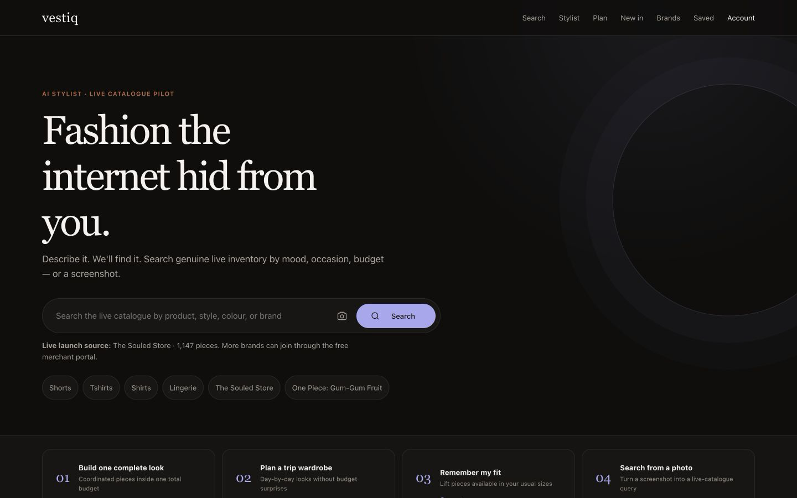
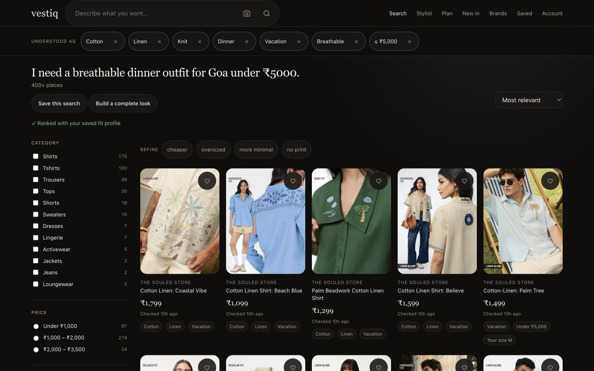
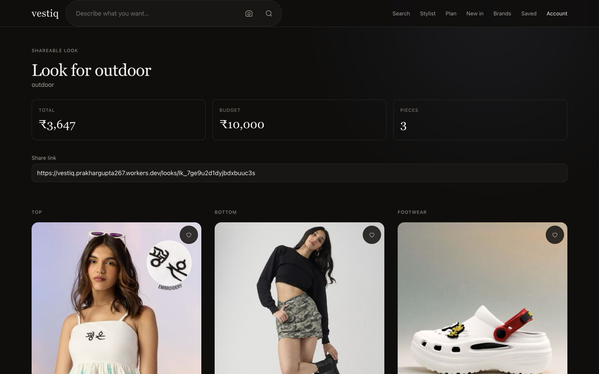
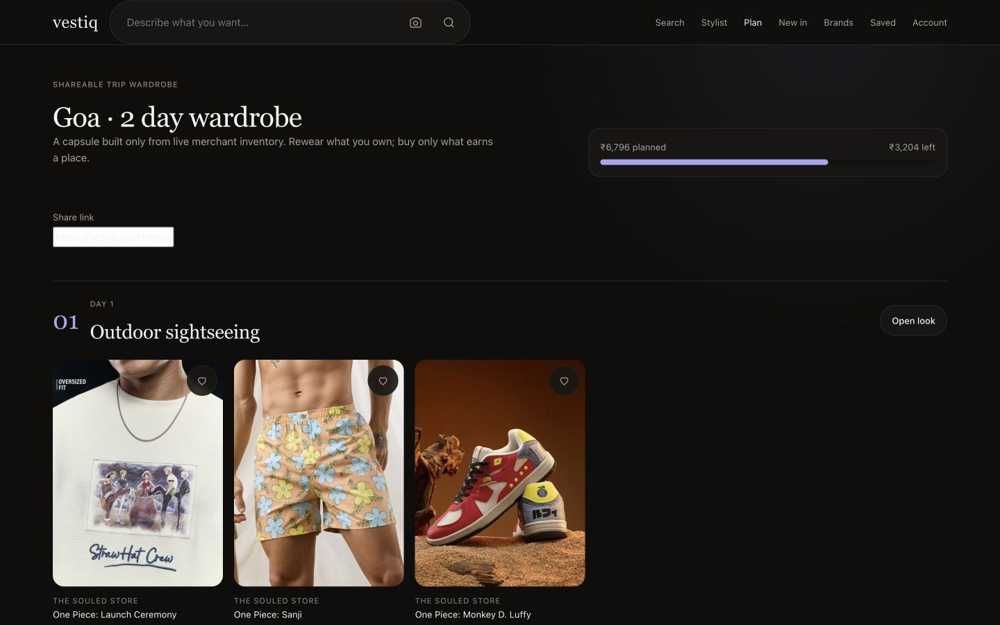
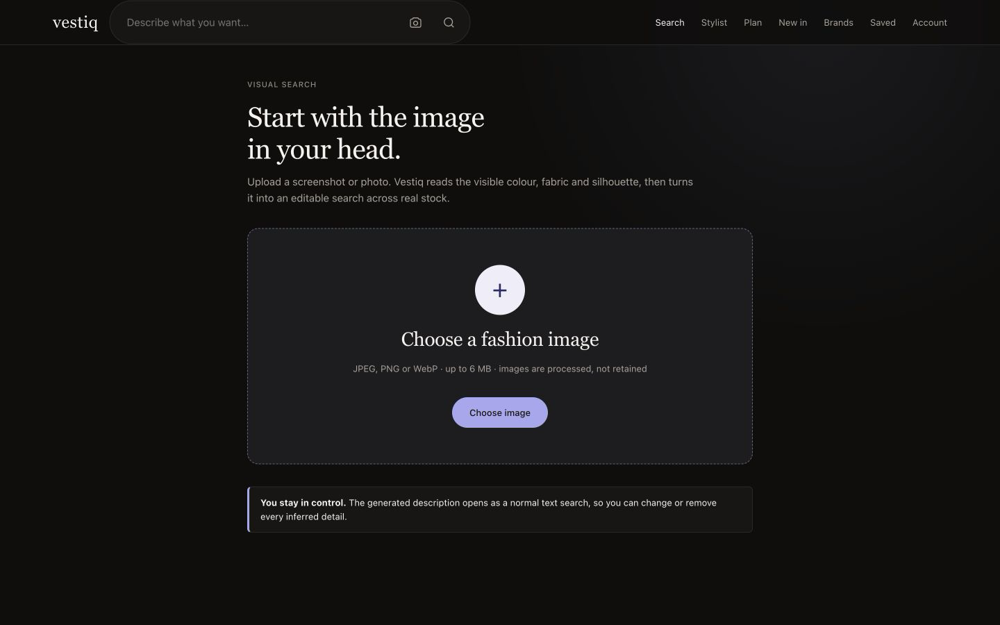

# Vestiq

**Describe it. We'll find it.**

AI-native fashion discovery for the long tail of independent Indian brands.
Describe what you want the way you actually think about it — a mood, an occasion,
a budget, a screenshot — and find it across brands the big marketplaces bury.

**[Open the live production demo](https://vestiq.prakhargupta267.workers.dev/)** ·
**[Watch the product walkthrough](docs/launch/vestiq-demo.mp4)** ·
**[Use the demo guide](docs/08-demo-launch-kit.md)**



The public pilot is running on Cloudflare with **1,347 genuine active products
from The Souled Store** (verified 12 September 2026). There are no invented
listings. Vestiq does not take payment: every product continues to the merchant's
own store and checkout.

---

## Use the live product

No account is required for the main demo. Start on the
[home page](https://vestiq.prakhargupta267.workers.dev/) or open a journey directly:

| Journey | What to do | What Vestiq returns |
| --- | --- | --- |
| [Natural-language search](https://vestiq.prakhargupta267.workers.dev/search?q=I%20need%20a%20breathable%20dinner%20outfit%20for%20Goa%20under%20%E2%82%B95000.) | Describe an occasion, style, colour, material or budget in one sentence. | Ranked live products, editable understanding chips, facets and match explanations. |
| [Build a complete look](https://vestiq.prakhargupta267.workers.dev/look-builder?q=breathable%20dinner%20outfit%20for%20men%20under%20%E2%82%B95000) | Enter one outfit brief and a total budget. | Coordinated pieces optimised together under the budget, ready to save or share. |
| [Plan a trip wardrobe](https://vestiq.prakhargupta267.workers.dev/trip-planner) | Add the destination, number of days, activities and shared budget. | Distinct day-by-day outfits that stay inside the trip total. |
| [Remember my fit](https://vestiq.prakhargupta267.workers.dev/profile) | Save usual sizes, preferred fit and materials to avoid. | Available pieces in the shopper's fit receive a soft ranking lift. |
| [Search from a photo](https://vestiq.prakhargupta267.workers.dev/visual-search) | Upload a JPEG, PNG or WebP fashion image up to 6 MB. | An editable text query inferred from visible colour, material and silhouette. The upload is processed, not retained. |
| [Ask the stylist](https://vestiq.prakhargupta267.workers.dev/stylist) | Chat naturally and refine the request over multiple turns. | A streaming answer with live product grids from Vestiq's own search index. |

Reliable prompts for a first demo:

```text
outdoor
black cotton t-shirt
Harry Potter oversized
I need a breathable dinner outfit for Goa under ₹5000.
```

After searching, remove or change any interpretation chip, sort or filter the
results, save pieces to the [wardrobe](https://vestiq.prakhargupta267.workers.dev/wardrobe),
create a price/restock alert, or follow a brand. Anonymous state works in the
browser; passwordless email sign-in carries it across devices.

| Natural-language search | Complete look |
| --- | --- |
|  |  |

| Trip wardrobe | Photo search |
| --- | --- |
|  |  |

### For merchants

Open [List your brand](https://vestiq.prakhargupta267.workers.dev/merchant/signup),
submit the store and contact details, and use the merchant portal to validate a
Shopify, Google Merchant Center or CSV feed. New sources remain in review until
an operator verifies inventory ownership and approves the brand. Approved
merchants receive row-level feed errors, catalogue health and demand-gap reports.
The launch is free and paid placement is not supported.

### For operators

The authenticated admin console covers merchant approval, feed jobs, catalogue
reports, zero-result demand, scheduler health and moderation. Operational access
is intentionally not published. The procedures are in the
[runbook](docs/06-runbook.md), while [deployment](docs/07-deployment.md) documents
Cloudflare resources, secrets, CI/CD, rollback and custom-domain setup.

---

## The idea in one paragraph

Three things collided in Indian fashion e-commerce. Supply exploded (Shopify made
it trivial for a designer in Jaipur to open a store, so there are tens of
thousands of them). Discovery didn't — marketplaces rank by ad spend and inventory
depth, so a brilliant 40-piece label with no ad budget is structurally invisible.
And LLMs just removed the cost of translating a *feeling* ("something for a beach
wedding that isn't sweaty") into a *taxonomy* (Women > Dresses > Maxi > Cotton).
The query language changed, so the index should change. Vestiq re-indexes the long
tail for natural-language intent.

Full reasoning, including an honest critique of the reference product and where
this differs: [`docs/01-product.md`](docs/01-product.md).

---

## What's built

**Search** — hybrid retrieval: FTS5 lexical + 384-dim int8 semantic vectors, fused
with Reciprocal Rank Fusion, then filtered, ranked by trust/freshness/popularity,
and explained. Six query modalities: mood, occasion, constraint, styling problem,
brand reference, image.

**Transparency** — every search shows what the AI *understood* as removable chips,
and every result shows why it matched. An opaque ranker becomes a correctable
filter set.

**Trust** — per-brand trust scores, `last_verified_at` on every listing, liveness
probes on click-hot items, and one-tap problem reports queued for moderation.

**Retention** — a browser-first wardrobe, cancellable price/back-in-stock alerts,
followed brands, daily saved-search digests, explicit taste controls and
personalised drops. Passwordless email accounts merge anonymous state so the
same wardrobe is available across devices.

**Supply side** — free self-serve merchant portal: paste a store URL, inspect feed
health with per-row rejection reasons, and use a demand gap report ("searches in
your categories that someone else won").

**Stylist** — streaming multi-turn chat that calls our own search and renders live
product grids inline, plus a full-look builder that searches outfit slots,
optimises the combination against one total budget, and saves a shareable look.

**Fit and trip planning** — a shopper-controlled fit profile softly lifts stock in
their usual sizes, while the capsule planner builds distinct daily edits under one
shared trip budget. Both survive passwordless sign-in and stay editable.

**Source and attribution transparency** — `/sources` shows the live catalogue
owners and freshness. Merchants can optionally append approved referral query
parameters to their own product URLs; those links are disclosed and marked
`sponsored`, but never influence ranking.

**SEO as the primary channel** — everything is server-rendered on the first byte,
with JSON-LD, partitioned sitemaps, and programmatic collection pages that are only
marked indexable at ≥12 genuinely matching items.

**Current public catalogue** — a genuine-inventory pilot with The Souled Store.
The product and merchant infrastructure supports multiple brands, but the live UI
does not pretend that additional merchants are active before they are authorised.

---

## Architecture

One Cloudflare Worker. No client framework — **5.2 KB of JS and 6.5 KB of CSS**,
against budgets of 24 KB and 14 KB enforced in CI. On a discovery product the
first paint *is* the pitch, so a hydration bundle would cost more conversions than
any interaction it buys.

```
Browser ─► Worker (Hono) ─┬─► D1      25 product tables + FTS5
                          ├─► KV      cache · vectors · sessions
                          ├─► Workers AI   parse · embed · vision · chat
                          └─► Gemini       optional upgrade
```

Notable decisions, with the reasoning in [`docs/03-architecture.md`](docs/03-architecture.md):

- **Server-rendered HTML, no SPA** (ADR-1) — SEO needs first-byte content.
- **Hybrid retrieval with RRF** (ADR-2) — vector-only fails on exactly the
  high-intent queries that convert best; RRF needs no score normalisation and no
  labelled data to tune.
- **Vectors in D1 blobs + a packed KV index, not Vectorize** (ADR-3) — outside the
  granted OAuth scopes, and at this scale a linear int8 scan is faster than a
  network round-trip to an ANN service.
- **Provider-abstracted AI with per-capability fallback** (ADR-5) —
  `gemini → workers-ai → heuristic`. The heuristic parser never fails and costs
  nothing, so **there is no single point of AI failure**: total inference outage
  degrades relevance, never returns an error page.
- **Cache the parse, not the results** (ADR-6) — the parse is stable and
  expensive; inventory is not.
- **Ranking integrity as an invariant** (ADR-10) — results are ordered only by
  relevance, trust, freshness, and shopper-selected sorting. There is no paid
  placement in the free launch.

---

## Getting started

Requirements: Node.js 20 or newer and npm. A Cloudflare account is only needed
when deploying or using remote D1/KV resources.

```bash
git clone https://github.com/prakhar267/vestiq.git
cd vestiq
npm ci
npm run db:migrate:local
npm run dev             # local dev at http://localhost:8787
```

Before submitting a change, run the same quality gate used by CI:

```bash
npm run verify          # typecheck, Vitest, Playwright + Axe, perf budget
```

The repository does not ship an invented catalogue. Onboard a real brand through
`/merchant/signup`, approve it in `/admin/brands`, then run its feed sync.
The managed Souled Store source uses a bounded, category-diverse men-and-women
snapshot and labels itself as partial so products outside that window are never
falsely marked sold out.

Deploy and operate: [`docs/07-deployment.md`](docs/07-deployment.md) ·
[`docs/06-runbook.md`](docs/06-runbook.md)

Production is continuously checked by GitHub Actions: pushes to `main` run
typechecking, 226 Vitest tests, 16 Playwright/Axe browser journeys and bundle
budgets before Cloudflare deployment. Independent synthetic checks exercise the
public routes twice per hour, while the catalogue scheduler runs every 15 minutes.
Use [`/health`](https://vestiq.prakhargupta267.workers.dev/health) for runtime
health and [`/ready`](https://vestiq.prakhargupta267.workers.dev/ready) for the
stricter launch-readiness report.

---

## Documentation

| Doc | Contents |
| --- | --- |
| [01-product.md](docs/01-product.md) | Teardown of the reference product, naming, PRD, mapped use cases, free-launch policy, metrics, risks |
| [02-design.md](docs/02-design.md) | Design thesis, tokens, type scale, components, screens, a11y, perf budget |
| [03-architecture.md](docs/03-architecture.md) | Topology, request path, data model, 10 ADRs, ingestion, security, failure modes |
| [04-qa-report.md](docs/04-qa-report.md) | Vitest + Playwright/Axe strategy, fixed journey defects, security testing, known limitations |
| [05-sre-readiness.md](docs/05-sre-readiness.md) | SLOs, verified failure modes, observability, capacity, scale triggers, rollback |
| [06-runbook.md](docs/06-runbook.md) | Incident procedures and routine operations |
| [07-deployment.md](docs/07-deployment.md) | Deploy, secrets, scheduler, custom domain, going live with real inventory |
| [08-demo-launch-kit.md](docs/08-demo-launch-kit.md) | Launch copy, 60-second demo, reliable prompts, gallery assets, demo-day checklist |

The QA report is worth reading even if you skip the rest: several bugs in this
build were *silent* — a dead lexical search arm, embeddings stored as TEXT, an AI
parser that failed on every request — and the section explains how each one hid,
which is more useful than the fixes themselves.

---

## Project layout

```
src/
  index.ts          Worker entry: middleware, routing, /health, error states
  types.ts          Shared domain types
  lib/              db · session · ratelimit · log · util (money, escaping)
  ai/               provider chain · gemini · workers-ai · heuristic parser · lexicon
  search/           orchestrator · lexical (FTS5) · vector (int8/KV) · rank · facets
  ingest/           feed adapters (Shopify/GMC/CSV/Souled Store) · normalise · upsert
  jobs/             job queue + scheduled task dispatcher
  routes/           pages · api · admin · merchant · seo · go (outbound)
  ui/               layout (CSP, JSON-LD) · components
  client/           small progressive-enhancement islands
migrations/         additive-only SQL
scripts/            migrate · embed · build-client · check-budget
tests/              unit + integration (real workerd, real D1)
```

---

## Free launch policy

Vestiq is free for shoppers and brands during launch. There is no Vestiq checkout,
consumer paywall, subscription, promoted placement, campaign budget, or payout
ledger. A brand may configure approved affiliate query parameters on its own
destination; those links are clearly disclosed and never affect organic ordering.

---

## Status

The application is configured for a real-catalogue-only launch. Migrations
`0002_free_launch_cleanup.sql` and `0003_launch_integrity_and_retention.sql`
remove both generations of invented catalogue data, block reserved destinations,
and preserve only real merchant inventory. `/health` pages on contamination;
`/ready` reports inventory, email, scheduler heartbeat, domain and AI launch
readiness. The public pilot has genuine live inventory, redundant scheduler
checks and production monitoring. A custom domain remains intentionally deferred
for the demo — see [`docs/08-demo-launch-kit.md`](docs/08-demo-launch-kit.md).
